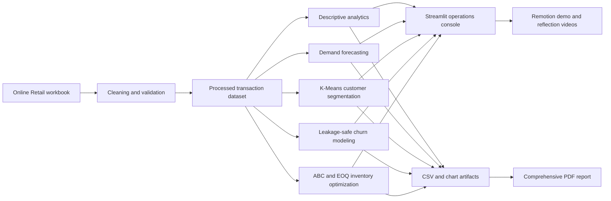

# RetailPulse Architecture

## System flow

## Boundaries

- `src/retailpulse/data.py` owns ingestion, cleaning, persistence, and time features.
- `src/retailpulse/analytics.py` owns descriptive business metrics.
- `src/retailpulse/ml.py` owns forecasting, clustering, churn validation, and inventory optimization.
- `src/retailpulse/visuals.py` owns interactive Plotly figures.
- `src/retailpulse/reporting.py` and `pdf_report.py` own generated reporting artifacts.
- `app/dashboard.py` composes the operational user experience.
- `video/` owns the reproducible demo and reflection video compositions.

## Production considerations

The current application is stateless and loads a checked-in processed CSV. For larger deployments, replace the CSV with a warehouse or columnar object storage, persist trained model artifacts, schedule data-quality checks, and add authentication and model-drift monitoring.

